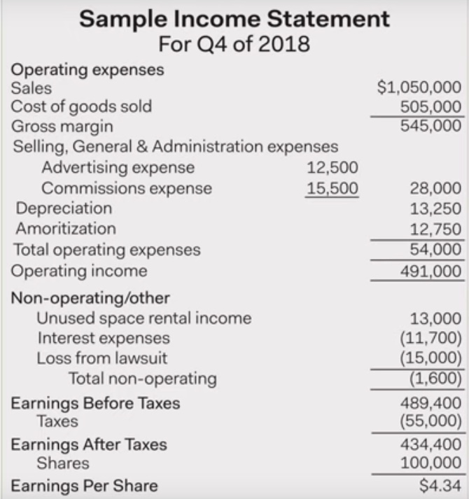
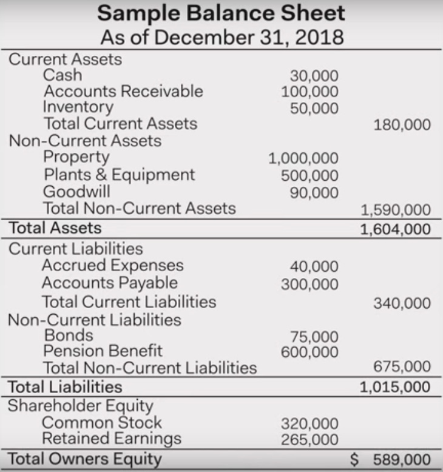

In understanding financial growth of a company while craeting an algorithm, it helps if we understand how to read the three main financial statements:
- [Income Statement](#Income-Statement)
- [Balance sheet](#Balance-Sheet)
- [Cash Flow Statement](#Cash-Flow-Statement)

## Income Statement
- Represents company's performance over a period in time.
- Contains info about company's revenue, expenses and net income.
- Predictions about company's earnings could be made using income statement. Which affects company's image in the market.

- Its often split into two sections
1. **Operating**
	- Contains info on primary business line of a company.
		> E.g. If a company's main line of business is Laptops, then operating section will contain info related to sale of laptops.
	
		- *sales* refers to the revenue from sales of the finished goods.
	- *cost of goods sold* (cogs) refers to cost asoociated with materials that go into production of the good. (The raw materials nothing else)
	- *Gross Margin* is the profit before deducting non-product operating expenses.
		- $Gross Margin = sales - cogs$
	- Now we list non-product operating expenses. These are the expenses not associated with cost of materials.
	- *Selling, General and Administration Expenses* (SGnA) are the expenses associated with the cost of producing the goods (except the materials).
		> E.g. Office Rent, Employee Salaries are examples of SGnA.
		
	- *Depreciation* is the cost of using fixed assets over the course of income period.
		> If $40 mil were spent on laptop manufacturing plant which could be used for 20 years, then each year the plant value would be depreciated by $2 million.
		
	- *Amoritization* is the process of paying off a debt with regular payments.
1. **Non Operating**
	- Contains info that is not related to company's primary line of business.
	- Useful to isolate company's primary business line from other expenses which could still affect company's net revenue.
	- *Earnings per share* : Earnings/Company's shares
		- Useful to compare companies within same industries.

## Balance Sheet
- It represents a company's performance at a specific point in time (date).
	
- Often split into 3 sections
1. **Assets**
	- Assets are listed at the top of the balance sheet.
	- They are listed in the order of their liquidity (i.e. how liquid they are.)
	- There are two types of assets
		1. *Current Assets* are the assets which would take less than a year to be liquidated.
			- *Accounts Recievable* is the amount to be recieved by the company from some sources which hasn't been received yet.
		2. *Non-Current Assets* are the assets which are illiquid i.e. would take more than a year if were to be liquidated.
			- There are 2 types of non-current assets
				1. *Tangible NCA* : property, plants and equipments (PPnE) are example of tangible NCA.
				2. *Non-Tangible NCA* : example of non-tangible NCA is Goodwill
2. **Liabilities**
	- Liabilities are the debts or obligations which a company owes.
	- Liabilities are listed in order in which they should be paid out first.
	- There are two types of liabilities:
		1. *Current Liabilities* are liabilities which could be paid out within one year.
			- *Accrued Expenses* are salaries of emplyees which hasn't been paid yet.
		2. *Non-Current Liabilities* are liabilities which would take more than a year to be paid off.
3. **Shareholder Equity** (Book Value)
	- Ownership of a company by its shareholders.
	- *Common stocks* are Proceeds from the sale of a common stock.
	- *Retained Earnings* are the prior earnings which could be paid out as dividends in future.
	> - It could also be thought of as the networth of a company. i.e. the value of each share if company were to shut off, selling all of its assets and paying off all of its debts.
	> - It does not equal the public market value i.e. value of its share in public market could be different than shareholder equity.
	
- Balance sheet must always balance \
	i.e. $Assets = Liabilities + Shareholder Equity$

## Cash Flow Statement
- [How to Read a Cash Flow Statement](https://www.youtube.com/watch?v=SXjfYfwVDJc&list=PLRFLF1OxMm_XpPOrNgSiuNJoa0H1Nl8dt&index=3) #todo

# References
- https://www.youtube.com/playlist?list=PLRFLF1OxMm_XpPOrNgSiuNJoa0H1Nl8dt